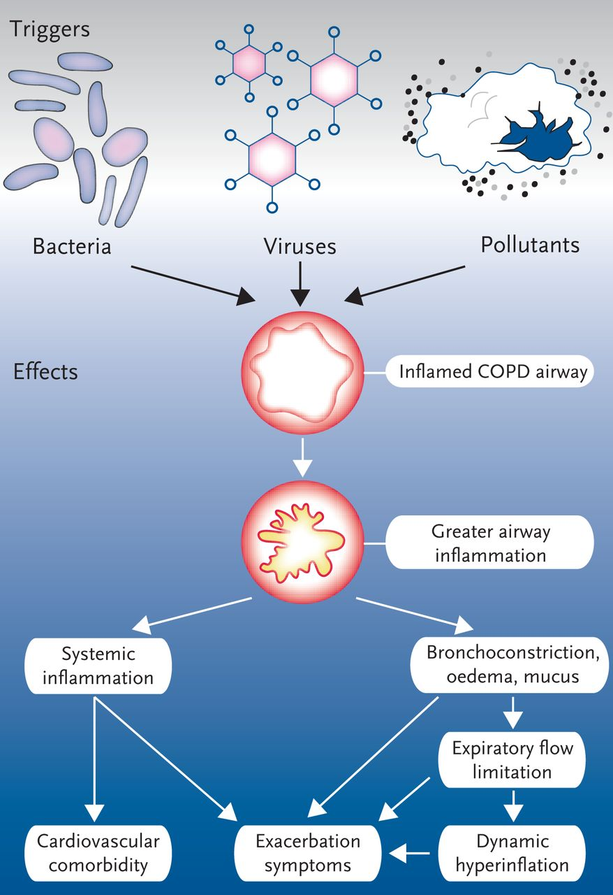
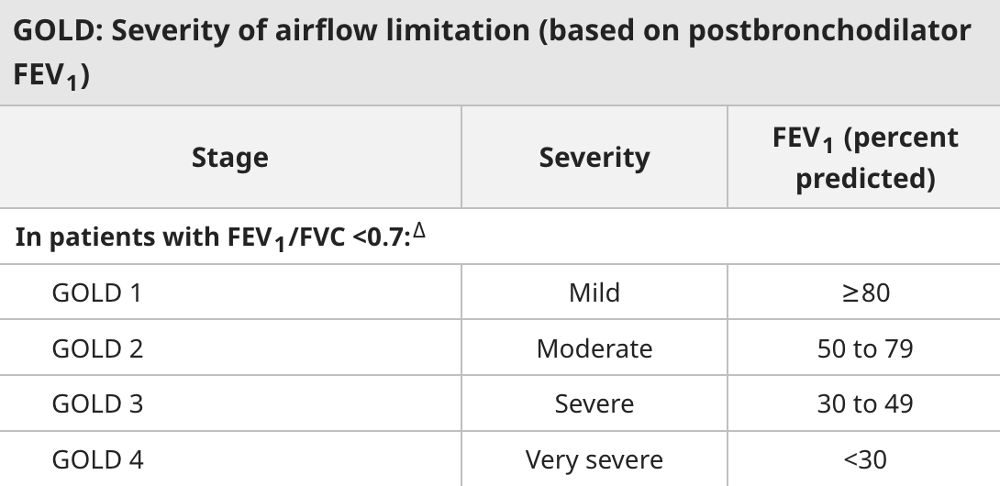
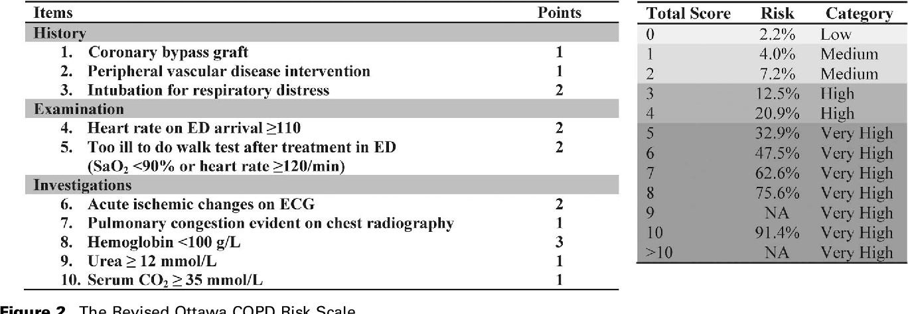
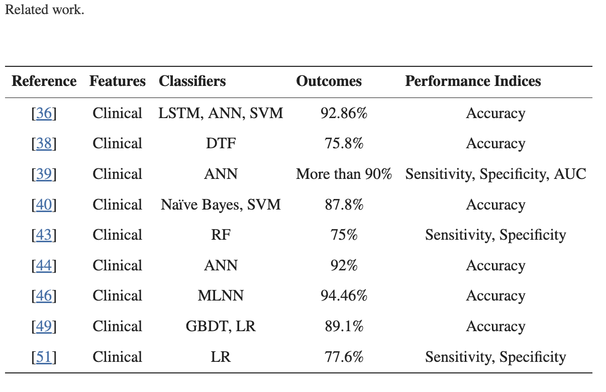
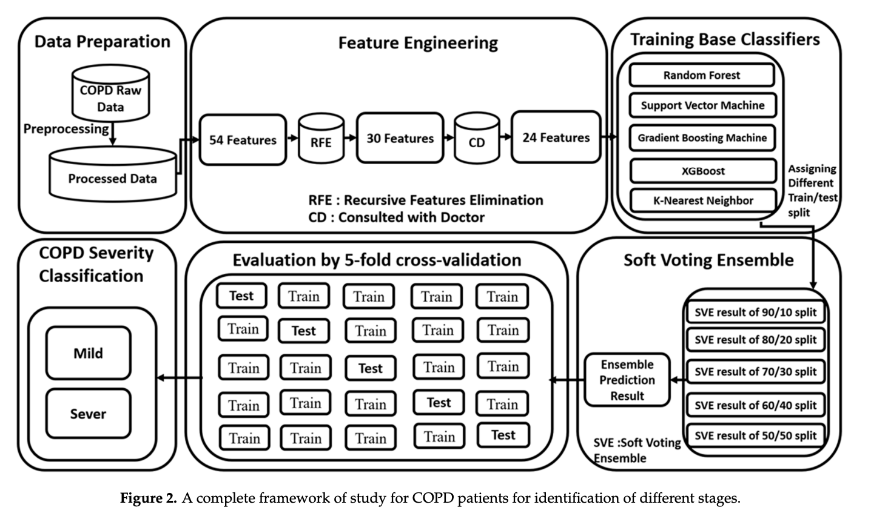
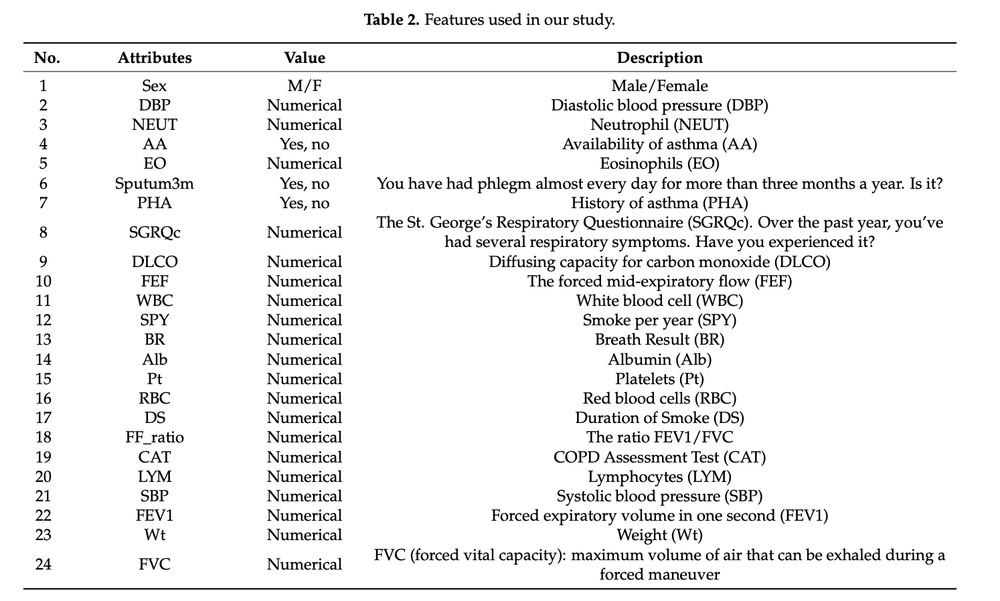
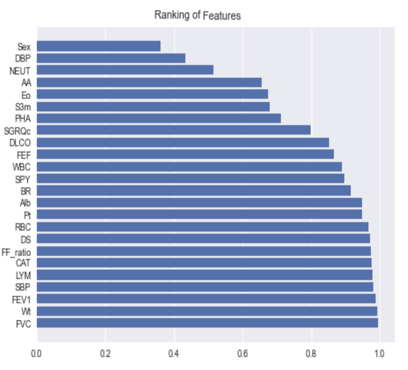

# Acute Exacerbation of COPD

Yilun Zhang
---
# Table of Contents

1. Background
2. Workup
3. Clinical Decision Making
4. Management
5. Latest Research + Economics
6. Takeaways
---
## Background
----
### Definition

``"an acute event characterized by a worsening of the patient's respiratory symptoms that is beyond normal day-to-day variations and leads to a change in medication"``

(WHO)

----
### Pathophysiology

**Primarily due to increased V/Q mismatch rather than expiratory airflow limitation.**

----
### Etiology of Exacerbations
- Most cases are caused by respiratory **viral** infections (rhinovirus being most common)
- *bacterial* infections include  Haemophilus influenzae, Moraxella catarrhalis, Streptococcus pneumoniae
- Other triggers include (25%):
     - drugs (beta-blockers)
     - environmental exposures (allergens, smoke, air pollution)
     - stress
     - PE
     - pneumothorax
     - medication non-compliance

----
### Clinical presentation

**2 of 3 cardinal symptoms**
1. increased dyspnea
2. increased sputum volume
3. increased sputum purulence
----
### Signs of impending respiratory failure...
- accessory muscle use (tripod position)
- pursed lip exhalation
- confusion
- diaphoresis
- poor air movement
----
### Prevention
- smoking cessation and pulmonary rehab
- proper inhaler technique
- routine immunizations
- Long term use of azithromycin or roflumilast in patients with frequent exacerbations
---
## Workup
----
### For Severe cases...
Patients who have COPD and respiratory distress or who are at risk of developing respiratory distress should be hospitalized and evaluated with:
- a chest radiograph
- electrocardiogram
- complete blood count
- basic metabolic panel
- oxygen saturation
- arterial blood gas

*sputum culture is not routinely used, rarely affects management*
---
## Clinical Decision Making
----
### Staging with GOLD severity of airflow limitation

----
### So who gets admitted?
According to GOLD/NICE admission criteria...
- marked increase in symptoms
- severe underlying comorbidities
- History of severe COPD
- older age
- frequent exacerbations
----
### Who gets an ICU bed?
- high-risk comorbidities (pneumonia, cardiac arrhythmia, heart failure, diabetes mellitus, renal failure, liver failure)
- Continued need for NIV or invasive ventilation
- Hemodynamic instability
- Need for frequent nebulizer treatments or monitoring

----
### Ottawa COPD Risk Scale (OCRS)

---
## Management
----
### Initial Therapy

Start inhaled SABA via nebulizer, MDI, or DPI
- can be combined with a short-acting muscarinic antagonist for dual therapy
- MDI vs Nebulizer: equal efficacy

----
### By Severity

- Mild: Short acting bronchodilators
- Moderate: Antibiotics (as per relevant bug(s)), glucocorticoids
  - IV vs Oral equally efficacious
- Severe: Admit for further workup

Supplemental oxygenation,Noninvasive positive pressure ventilation, mechnical ventilation as necesarry (to maintain O2 sat 88-92%)

----
### Treatments that are currently evidence-less...
- mucoactive agents (eg, N-acetylcysteine)
- Methylxanthines
- Magnesium (nebulized or IV)
- Chest physiotherapy
---
## Latest Research and Economics
----
### AI: Predicting and Forecasting AECOPD
----
### Forecast the Exacerbation in Patients of Chronic Obstructive Pulmonary Disease with Clinical Indicators Using Machine Learning Techniques

- accuracy of 91.0849% for binary classification (mild vs severe) using a **Soft Voting Ensemble (SVE) model**
- single institution, 2900 patients
- twenty-four features for chronic obstructive pulmonary disease (COPD) patients

----

----

----

----
### Some Fun facts about $$$

A study of Medicare beneficiaries found a 64 percent readmission rate after a discharge for a COPD exacerbation

Exacerbations account for the greatest proportion of costs associated with chronic obstructive pulmonary disease (COPD)

Mean cost per patient 6760$(USD)

---
# FIN
