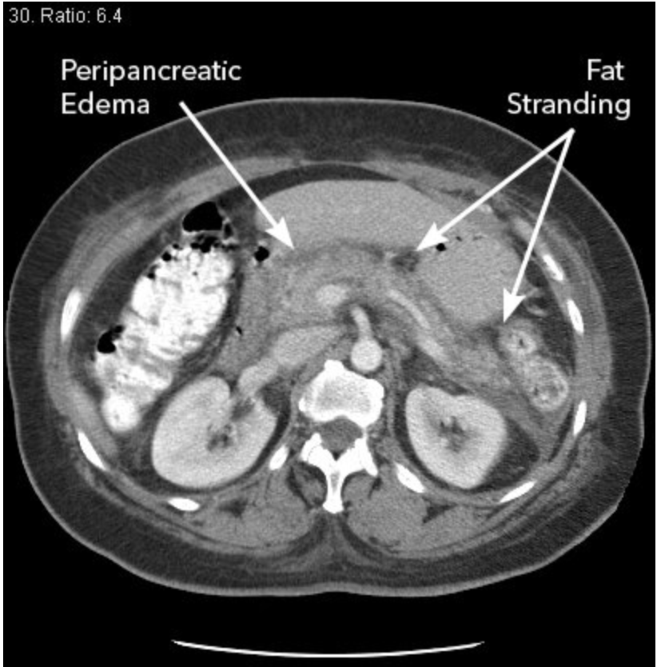

# Acute Pancreatitis
Yilun Zhang

#

---
# Table of Contents

1. Etiology
2. Clinical Features + Diagnosis
3. Differential
4. Management
5. Takeaways
---
## Pathphysiology + Etiology
=
### Pathophysiology
- Duct and acinar indirect/direct injury
  - impaired secretion
    - premature activation of digestive enzymes (proteases)
      - autodigestion and acute inflammation
=
### Most Common
- Biliary Disease
  - **stones (40%)**
  - sludge
- **Alcohol (30%)**
- ERCP (5%)
=
### Less Common
- *Medications (5%)*
  - Furosemide
  - Didanosine
  - Asparaginase
  - Mesalamine
  - Thiazides
  - 6-Mercaptopurine/azathioprine
  - Sulfasalazine
  - Estrogen
- *Hypertriglyceridemia (2-5%)*
- Hypercalcemia
=
### Rare
- infectious
- ischemia
- traumatic
- neoplasia
- Celiac diseases
---
## Clinical Features + Diagnosis
=
### Presentation
- **Epigastric or LUQ pain (90%)**
  - only HALF have radiating to the back
- **N/V (90%)**
- Dyspnea (severe patients, due to diaphragmatic inflammation)

*10% have atypical presentation WITHOUT pain and unexplained hypotension*

###### Time course
- Early phase (<1 wk)
  - possible SIRS + organ failure
- Late phase
  - local complications
=
### Diagnosis
- 2 of 3 criteria:
    1. classic abdominal pain
    2. lipase/amylase >3x upper normal limit
        - rises faster than amylase
    3. findings on imaging
        - U/S should be used to r/o biliary etiologies
        - CT only to investigate complications
---
## Differential
=
### Differential
Generally, other sources of epigastric pain, can be distinguished with **contrast enhanced** CT
- Acute cholecystitis
- Perforated viscus
- SBO
- mesenteric ischemia
- Ruptured ectopic pregnancy
- AAA
---
## Management
---
## Initial
- Fluids
  - aggresive in first 24h
  - 20 ml/kg IV Bolus --> 3 ml/kg/hr
  - LR > NS
  - Goal: Decrease BUN and HCt
- Pain Mgmt (usually IV opiods)
- Anti-emetics

**antibiotics are not warranted in acute pancreatitis unless there is evidence of extrapancreatic infection, such as ascending cholangitis, bacteremia, urinary tract infection, or pneumonia. Use of prophylactic antibiotics in patients with sterile pancreatic necrosis to prevent infected necrosis is not recommended.**
=
## Nutrition + Insulin
- Early enteral feeding is encouraged --> transition to PO as tolerated
- Enteral > TPN to decrease risk of infectious complications

In the case of hypertriglyceridemia --> insulin gtt (activates lipases) + fibrates
---
## Takeaways (taken from MKSAP19)
- Biliary disease (gallstones, biliary sludge, or microlithiasis) is the most common cause of acute pancreatitis.
- Diagnosis of acute pancreatitis requires two of three criteria:
  - (1) acute-onset upper abdominal pain
  - (2) serum lipase or amylase levels elevated at least three times the upper limit of normal
  - (3) characteristic findings on imaging
- Patients with acute pancreatitis should undergo transabdominal ultrasonography rather than CT for evaluation of biliary disease.
- Early and aggressive fluid resuscitation should be initiated in patients with acute pancreatitis.
- In mild acute pancreatitis, oral feedings can be started as soon as nausea and vomiting are controlled and clinical symptoms are alleviated; enteral feeding should begin within 72 hours if oral feeding is not tolerated.
- Pancreatic pseudocysts do not require drainage unless they cause significant symptoms or are infected, regardless of size.
---
