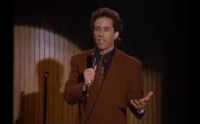

# Decannulate or not Decannulate: That is the Question
## Yilun Zhang
## October 14th, 2022
### Tufts Medical Center

---
# Table of Contents

1. Problem
2. Question
3. Value Proposition
4. Literature
5. Proposed Protocol
6. Next Steps 
7. Takeaways
---
## 1. Problem
---

- Since 2014, the incidence of tracheostomy has tripled in patients needing mechanical ventilation
- COVID times
- Not too soon, not too late, just right
- Difference in  "expert opinion"
     - RT's prefer tolerance of capping
     - Physicians use level of conciousness
     - Temporal Range (48-72h)

---
## Question
=
Is our current practice at TMC of using the common 24h capping trials for patients with tracheostomy a good assessment of decannulation readiness?
- are there better objective and/or subjective metrics to track?
- can our rate of recannulation OR time to successful decannulation be improved upon?
---
## Value Proposition
=

source: https://www.passy-muir.com/wp-content/uploads/2018/10/costs_related_to_tracheostomy.pdf

=

Patients who require tracheostomy for respiratory failure, diagnosis-related group (DRG) 483,
have a high consumption of resources. By DRG categories, they have the highest patient costs
and the highest hospital reimbursement.4

=

29 days Average length of stay for a tracheostomized patient5
$265,499 Average amount of hospital charges associated with tracheostomy5
$60 Billion Expected national bill in the year 2020 associated with prolonged mechanical ventilation6

=
# mortality for those who get decannulated are significantly lower at one year
Four hundred twenty-nine patients were studied. Hospital mortality was 19%. Only 57% of
survivors were liberated from mechanical ventilation. At 100 days, 6 months, 1 year, and 2
years after discharge, 24%, 30%, 36%, and 42% of hospital survivors had died, respectively.
Patients liberated from mechanical ventilation and having their tracheostomy tubes
decannulated had the lowest mortality (8% at 1 year); the mortality of ventilator-dependent
patients was highest (57%). Sixty-six patients completed the SF-36 for functional status. While
emotional health was generally good, physical function was quite limited. **Median hospital direct
variable cost was $29,340. **

=

# trach teams have decreased times to decannulation

---
https://jintensivecare.biomedcentral.com/articles/10.1186/s40560-017-0234-z

---
# Current Literature/Standards
=
## REDECAP
=

=
## Potential mechanism
1. **More Oxygen = More better!**
2. Capping Trials are more demanding than we think

---
# Next Steps
=
# Some preliminary data

(provided by Leslie from RT)
=
## Following validation of proposed protocol...
- Introduce structured documentation of quantitative/qualitative
     + Propagate this down/up-stream
- Prediction Model to Forecast Significant Timepoints
     + Bayesian Model

=
# Bayes?

=
## Following validation of proposed protocol...
- Introduce structured documentation of quantitative/qualitative
     + Propagate this down/up-stream
- Prediction Model to Forecast Significant Timepoints
     + Bayesian Model
- Predicting likelihood of recannulation success
- Case MGMT: Proper allocation of resources
     + Right time Right Resource
     
---
# Takeaways
1. Assessing trach decannulation readiness is often non-standardized and can be better managed beyond just a CAP trial
     - Less is More: Do less, Better Outcome
2. Dollar Saved is a Dollar Made: Overall cost can be decreased by getting these patients out and collaborating with case MGMT and RT
3. Standardization/Protocolization gives rise to the potential for the development of novel tools to assist all in decision making 
---
# Big thank you to all the folks on the trauma team for everything (and entertaining this) and especially Marina for the encouragement, Leslie from RT for the data, Marlon from case management for context, and Dr. Bugaev for the guidance!

