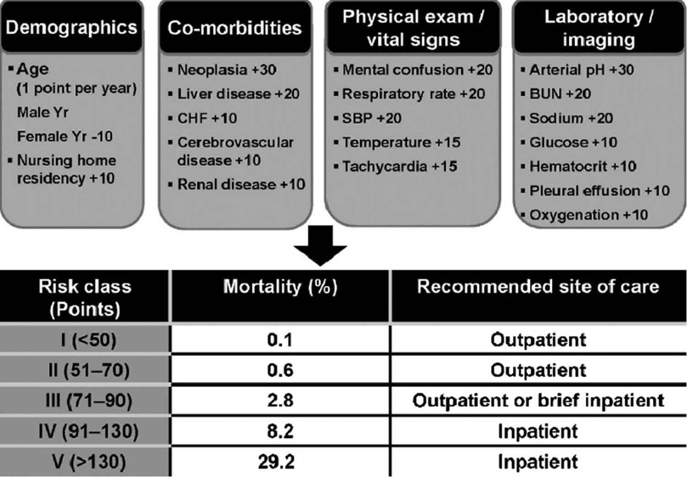
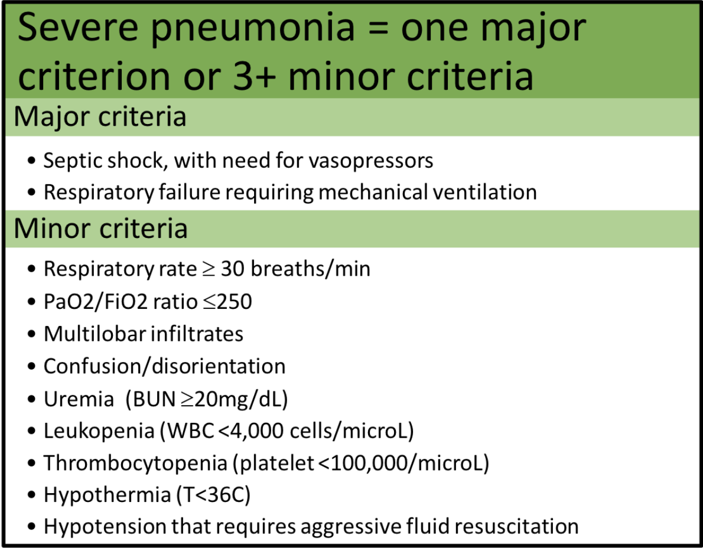
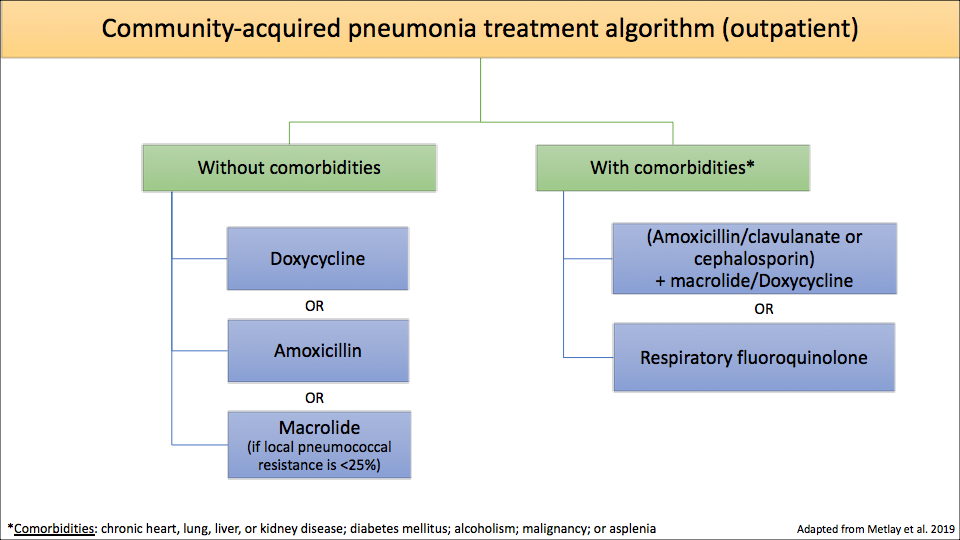
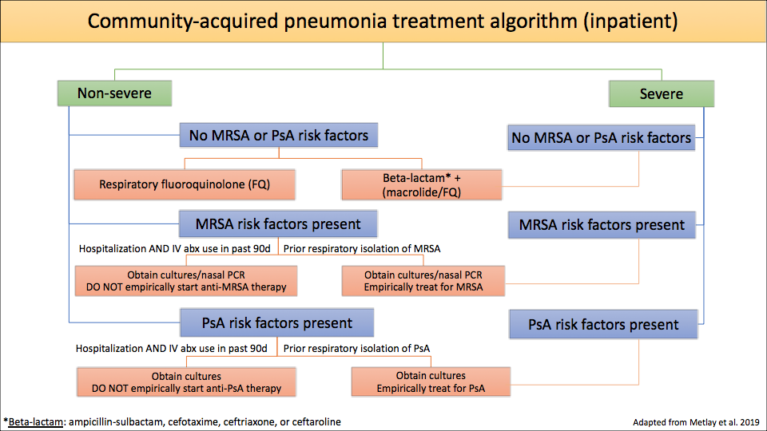

# Pneumonia
Yilun Zhang
August 1st, 2022
---
# Table of Contents

1. Etiology
2. Clinical Features + Diagnosis
3. Differential
4. Management
5. Takeaways
---
## Etiology
=
## Types of Pneumonia
- Community-Acquired pneumonia
- Hospital-Acquired pneumonia
  - Ventilator-Acquired pneumonia
- Aspiration pneumonia

**PLUS, typical vs atypical**

*HCAP no longer exists*
=
## Community-Acquired pneumonia
#### Typical
- **Streptococcus pneumoniae (most common)**
    - Also the most common pathogen in nursing home residents
    - Most common cause of pneumonia in persons who inject drugs
- Haemophilus influenzae + Moraxella catarrhalis
  - usually seen in patients with chronic pulmonary diseases
- Klebsiella pneumoniae
- Staphylococcus aureus
#### Atypical
- Bacteria
  - **Mycoplasma pneumoniae (most common in the ambulatory setting)**
  - Chlamydophila pneumoniae
  - Chlamydophila psittaci
  - Legionella pneumophila → legionellosis
  - Coxiella burnetii → Q fever
  - Francisella tularensis → tularemia
- Viral (RSV,influenza, CMV, adenovirus, COVID)
=
### Hospital-Acquired pneumonia
- Gram-negative pathogens
  - Pseudomonas aeruginosa
  - Enterobacteriaceae
  - Acinetobacter spp
- Staphylococcus aureus
- Streptococcus pneumoniae
---
## Clinical Features and diagnosis
=
## Diagnosis
new or progressive radiographic infiltrate (CXR -> CT) plus clinical signs of pneumonia (fever, purulent sputum, leukocytosis, hypoxemia)
##### Further Workup
- sputum cultures
- *blood cultures before Antibiotics*
- *procalcitonin (useful for differentiating bacterial vs viral)*
- bronchoscopy if severe
- Rapid NAAT for influenza (if appropriate)
- Urine pneumococcal antigen and Legionella antigen (if appropriate)
=
## New ISDA guidelines...
- Only obtain blood cultures in severe CAP or if risk factors for MRSA and/or PsA are present
- Procalcitonin should NOT be used in the diagnosis of CAP
---
## Differential
=
Pretty straightforward....
---
## Management
=
## Assessing disease severity
- qSOFA: predict poor outcome, ICU stay, mortality
  - bad score if:
    - RR > 22
    - AMS
    - SBP < 100
- CURB-65: for triaging level of care
  - Inputs:
    - confusion
    - BUN > 20
    - RR > 30
    - BP < 90/60
    - Age > 65
  - 0-1 = outpatient
  - 2 = inpatient
  - >3 = ICU
- **Pneumonia Severity Index (PSI)**
=
## As per ISDA... PSI > CURB-65

=
##  Treatment is now based on severity of the pneumonia rather than the location of the admitted patient

=
## Overview of Treatment
| Scenario         | Treatment                                                    |
|------------------|--------------------------------------------------------------|
| CAP (outpatient) | Azithro OR Doxy                                              |
| CAP (inpatient)  | FQ + 3rd gen Ceph OR amp-sulbactam                           |
| CAP (ICU)        | FQ + 3rd gen Ceph OR amp-sulbactam                           |
| HCAP + VAP       | (Pip-tazo OR Cefepime OR carbapenem) + (vanco or linezolid)  |
| Aspiration       | Amox-clav, amp-sulbactam, FQ, carbapenem                     |

**steroids may be considered for severe CAP**
=
## ISDA Algorithm for outpatient treatment of CAP

=
## ISDA Algorithm for inpatient treatment of CAP

=
# Some extra ISDA guidelines for fun...
- Treat anaerobes only in cases with suspected or proven lung abscess and/or empyema
- Continue antibiotics for at least 48 hours in patients who are diagnosed with influenza pneumonia
- Duration of antibiotics is based on clinical improvement (but should be a minimum of 5 days)
- Do not use corticosteroids as adjunctive treatment and do not obtain routine follow up chest X-rays
---

=
## ISDA Guidelines (HAP + VAP)
=

---

---

