## TREWS: An Automated Sepsis Detection System
(*targeted real-time early warning system*)

Yilun Zhang

January 20, 2023

Winchester Hospital

---
## The Problem
= 
## Sepsis Detection in the ED
- Early Detection + Treatment is Key 
- Sepsis course is relatively heterogenous; leading to delayed detection
- Efficient triage allows for efficient use of upstream resources
- ED providers are burdened with volume and horizontal survilience
=
## Detection vs Onset vs Prediction
Typical Clinical course:
- Patient arrives to ED
- **"concern for sepsis"**
- Physiological **Onset** of Sepsis
- Clinical **Detection** of Sepsis
- 1 Hour bundle delivered
- Triage to ICU/floor as indicated 

#### Improving this outcome requires decreases in *t* to each time point w.r.t. to physiology
=
## The Problem Space
Known quantitative ways to assess Sepsis severity/mortality:
- SIRS
- q/SOFA
- SAPS II
- SCS
- MEWS

#### However, although they are quantitative in nature, they are *practically* binary in their value as they rely on measures of organ dysfunction!
---
## Brief Primer on AI/ML and Statistics
=
#### So what's the deal with AI?
 
=
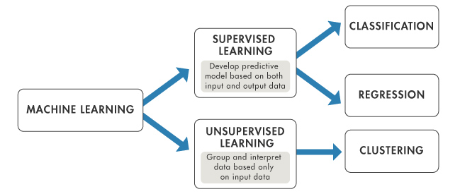
=
## Supervised Learning
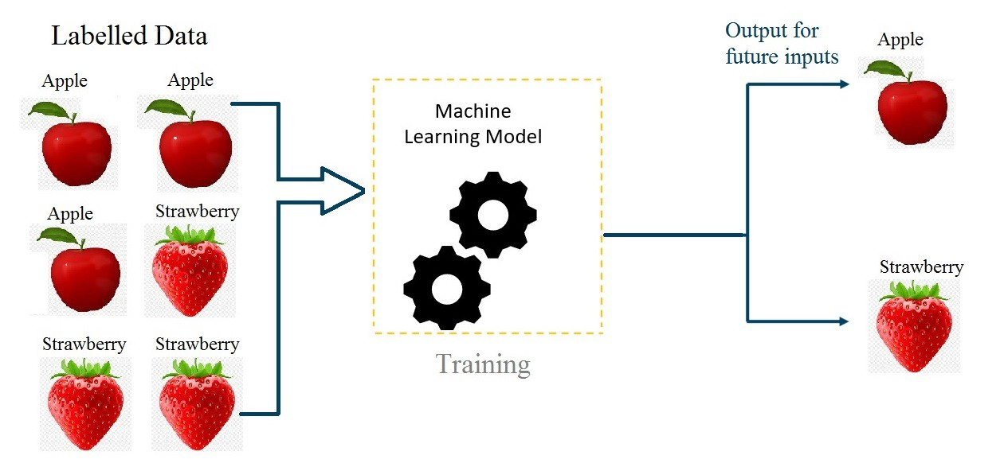
=
## Bayesian Statistics
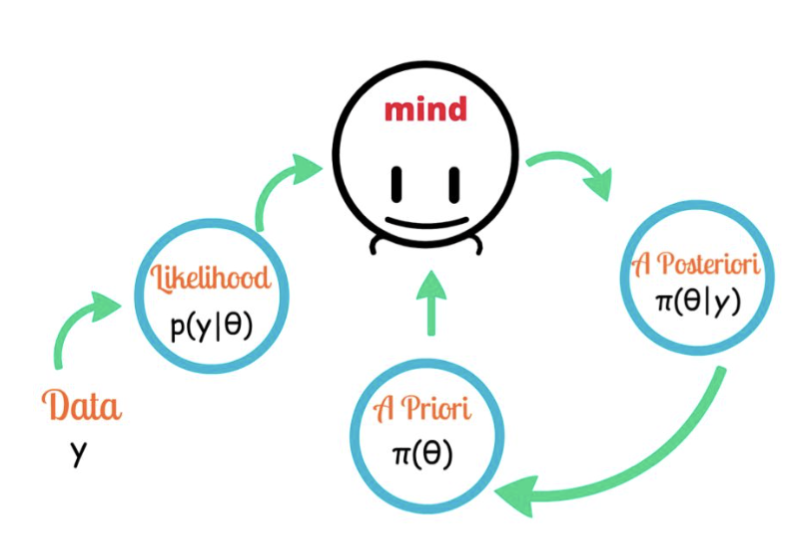

---
## TREWS Model
=
## The JHU Group
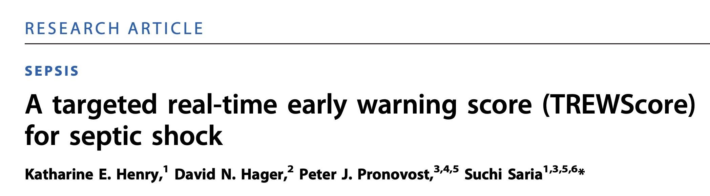

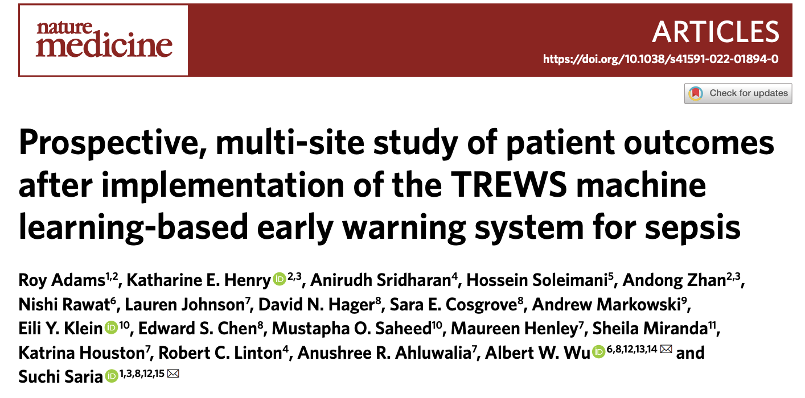
=
## TREWScore
=
## Big Picture
- Supervised Learning Model trained from [MIMIC-II Clinical Database](https://physionet.org/about/)
    - 13,014 patients w/ outcomes from BIDMC
    - Routine EHR data
    - 27 features used
- Controls:
    -  "Routine Screening" by 2/4 SIRS Criteria
    -  MEWS score is a severity score for ICU triage in surgical patients
- Outputs:
    - Likelihood of developing sepsis
    - Likelihood of developing severe Sepsis (BEFORE end organ damage)

=
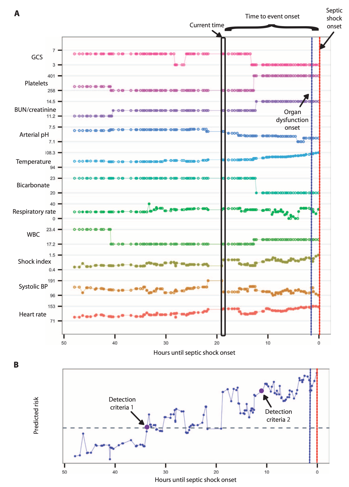
=
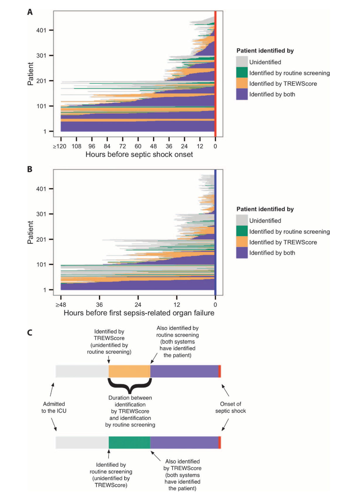
=
## Validation of Sepsis Detection
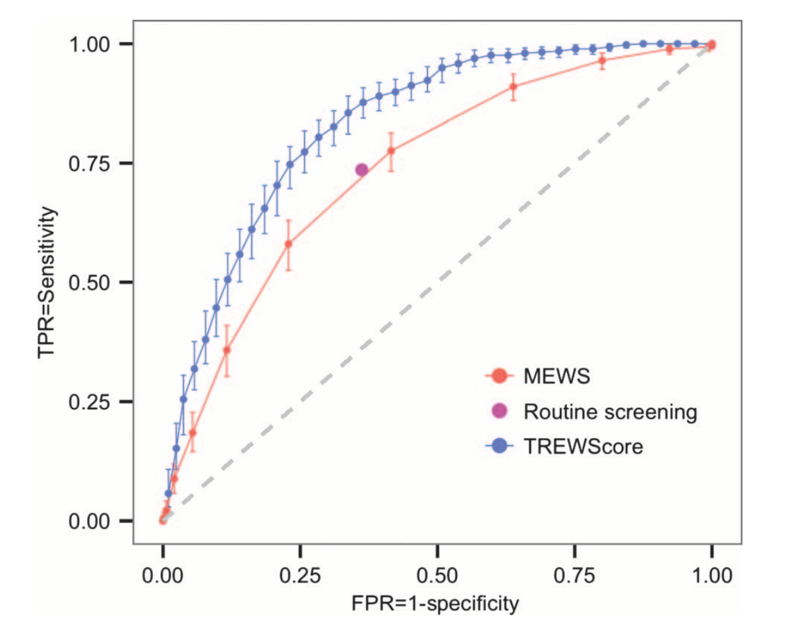
= 
## So What?
- really holds no clinical value as this was developed in a vacuum
- unclear if even *earlier* Early Goal Directed Therapy is even clinically beneficial
- Prospective validation + Generalization required

---
## Clinical Implementation and Real World Perfomance
= 

=
## Big Picture
- Multi-site (5) two-arm cohort study
- 590,736 patients *monitored*
- Focused on **clinical outcomes** based on model predictions and *clinician interaction*
- Real-Time integrated into Epic

> Notably, we found that sepsis patients who had their alert evaluated
and confirmed within 3h had a 1.85-h lower median time from alert
to first antibiotic order
> 

=
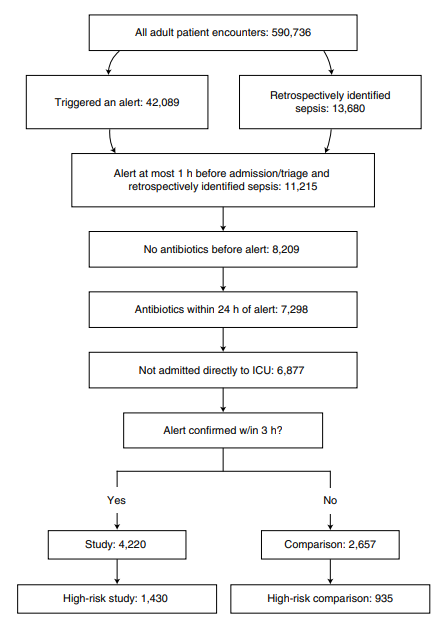
=
## Results
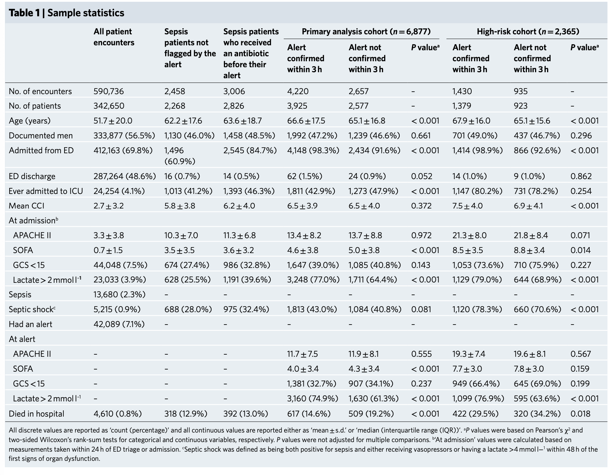
=
## Results, *TLDR*
- after adjusting across patient metadata using logistic regression to estimate ARD and ARR...
    - timely provider evaluation and confirmation ofthe TREWS alert were associated with reduced mortality 
    - SOFA score progression
    - reduced median length of stay among survivors
    - delay in antibiotics relative to the time of the alert was associated with increased patient mortality 
=
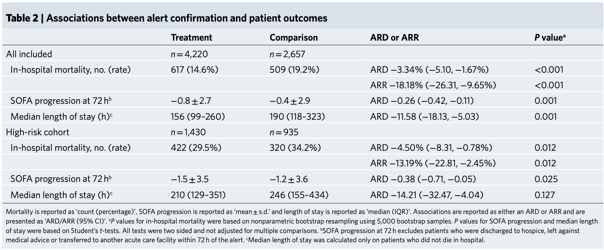
---
## Implications
= 
[Bayesian Health](https://www.bayesianhealth.com/)
=
## Open Source
https://github.com/royadams/adams_et_al_2022_code/blob/main/trews_patient_outcome_analysis_public.ipynb
---
Thank you for your attention!

Link to Slides